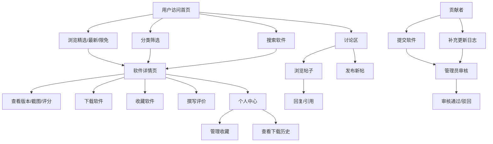

## 1. 产品概述
Mac 软件社区，面向 Mac 用户发现、评价和交流常用 macOS 软件的平台。
- 主要目的：为 Mac 用户提供一站式软件发现、评测、讨论平台，解决优质软件难发现、信息不对称的问题
- 目标用户：Mac 设备用户、软件开发者、设计师、办公人士
- 市场价值：构建 Mac 软件生态社区，连接用户与开发者

## 2. 核心功能

### 2.1 用户角色
| 角色 | 注册方式 | 核心权限 |
|------|----------|----------|
| 普通用户 | 邮箱/手机号注册 | 浏览软件、收藏、下载、发帖、评分、评论 |
| 贡献者 | 用户申请升级 | 提交软件、补充更新日志、认领维护软件 |
| 管理员 | 后台添加 | 审核投稿、处理违规、管理专题、用户管理 |

### 2.2 功能模块
1. **首页**：精选软件、最新上架、限免提醒、热门讨论
2. **软件详情页**：版本记录、兼容系统、截图预览、下载入口、替代品推荐、用户评分
3. **分类页**：按办公、开发、设计、效率筛选并收藏
4. **讨论区**：发帖、回复、引用、置顶、举报
5. **个人中心**：收藏管理、关注作者、下载历史、评价草稿
6. **贡献者后台**：提交软件、补充更新日志、认领维护
7. **审核页**：处理投稿、评论、违规链接、专题推荐

### 2.3 页面详情
| 页面名称 | 模块名称 | 功能描述 |
|----------|----------|----------|
| 首页 | 导航栏 | Logo、搜索、分类入口、用户头像/登录 |
| 首页 | Hero 区 | 精选软件轮播、社区标语 |
| 首页 | 精选软件 | 编辑推荐软件卡片网格展示 |
| 首页 | 最新上架 | 时间排序的软件列表 |
| 首页 | 限免提醒 | 限时免费/折扣软件专区 |
| 首页 | 热门讨论 | 高热度讨论话题展示 |
| 软件详情页 | 软件基本信息 | 名称、图标、评分、下载量、分类标签 |
| 软件详情页 | 版本记录 | 历史版本更新日志时间线 |
| 软件详情页 | 兼容系统 | 支持的 macOS 版本、Apple Silicon/Intel 兼容标识 |
| 软件详情页 | 截图预览 | 软件截图轮播/灯箱预览 |
| 软件详情页 | 下载入口 | 官方下载、App Store 链接、本地下载 |
| 软件详情页 | 替代品推荐 | 同类/替代软件推荐列表 |
| 软件详情页 | 用户评分 | 星级评分、评分分布、评价列表、撰写评价 |
| 分类页 | 分类筛选 | 办公、开发、设计、效率四大分类 Tab |
| 分类页 | 子分类标签 | 二级分类筛选标签 |
| 分类页 | 软件列表 | 可排序（热度/评分/时间）软件网格 |
| 分类页 | 收藏功能 | 一键收藏/取消收藏软件 |
| 讨论区 | 帖子列表 | 按板块/热度/时间排序的帖子列表 |
| 讨论区 | 发帖功能 | 标题、内容、标签、板块选择 |
| 讨论区 | 帖子详情 | 楼主内容、回复列表、引用回复、举报 |
| 讨论区 | 管理功能 | 置顶、加精、删帖（管理员） |
| 个人中心 | 收藏管理 | 已收藏软件列表、批量操作 |
| 个人中心 | 关注作者 | 关注的贡献者/开发者列表 |
| 个人中心 | 下载历史 | 下载过的软件历史记录 |
| 个人中心 | 评价草稿 | 未发布的评价草稿箱 |
| 贡献者后台 | 软件提交 | 新软件投稿表单（名称、描述、下载链接等） |
| 贡献者后台 | 更新日志 | 为维护的软件补充版本更新信息 |
| 贡献者后台 | 认领维护 | 申请成为某软件的维护者 |
| 贡献者后台 | 投稿状态 | 查看所有投稿的审核进度 |
| 审核页 | 投稿审核 | 待审核软件列表、通过/驳回操作 |
| 审核页 | 评论审核 | 待审核评论、违规评论处理 |
| 审核页 | 链接审核 | 违规下载链接检测和处理 |
| 审核页 | 专题推荐 | 创建和管理首页专题、精选推荐 |

## 3. 核心流程

用户从首页浏览软件，通过分类或搜索找到感兴趣的软件，进入详情页查看版本信息、截图和用户评价，可直接下载或收藏。用户可在讨论区发帖交流使用心得，贡献者可提交新软件或维护已有软件信息，管理员负责审核所有内容。

## 4. 用户界面设计

### 4.1 设计风格
- 主色调：深空蓝 #1E3A5F 搭配银灰色 #8A9BA8，体现 macOS 简约质感
- 辅助色：苹果绿 #34C759（成功）、系统橙 #FF9500（限免/折扣）、系统红 #FF3B30（警告）
- 按钮风格：圆角 12px，微阴影，hover 时有微妙的缩放和高光过渡
- 字体：SF Pro Display 展示字体 + SF Pro Text 正文字体（系统字体回退）
- 布局风格：卡片式布局，毛玻璃效果（backdrop-filter），大量留白
- 图标风格：统一 SF Symbols 风格，线性简洁图标

### 4.2 页面设计概览
| 页面名称 | 模块名称 | UI 元素 |
|----------|----------|----------|
| 首页 | Hero 区 | 毛玻璃卡片、渐变背景、轮播动画、淡入效果 |
| 首页 | 软件卡片 | 圆角 16px、悬停上浮 + 阴影加深、图标带光泽 |
| 首页 | 限免专区 | 橙色标签、倒计时动画、脉冲效果 |
| 软件详情页 | 截图预览 | 灯箱效果、左右切换、键盘方向键支持 |
| 软件详情页 | 评分组件 | 星级动画、评分分布柱状图 |
| 分类页 | 分类 Tab | 下划线滑动动画、激活状态高亮 |
| 讨论区 | 帖子卡片 | 热度标识、用户头像、标签徽章 |
| 个人中心 | 侧边导航 | 图标 + 文字、激活状态背景色 |
| 审核页 | 数据表格 | 斑马纹、操作按钮组、状态徽章 |

### 4.3 响应式
- 桌面端优先设计（1440px 基准）
- 平板端：两栏布局，侧边栏可收起
- 移动端：单栏布局，底部 Tab 导航，手势支持

### 4.4 动效设计
- 页面切换：淡入 + 轻微上移动画（300ms）
- 卡片悬停：translateY(-4px) + box-shadow 加深（200ms ease-out）
- 按钮交互：scale(1.02) on hover，scale(0.98) on active
- 加载状态：骨架屏 + shimmer 效果
- 模态框：backdrop 淡入 + 内容从中心缩放出现
