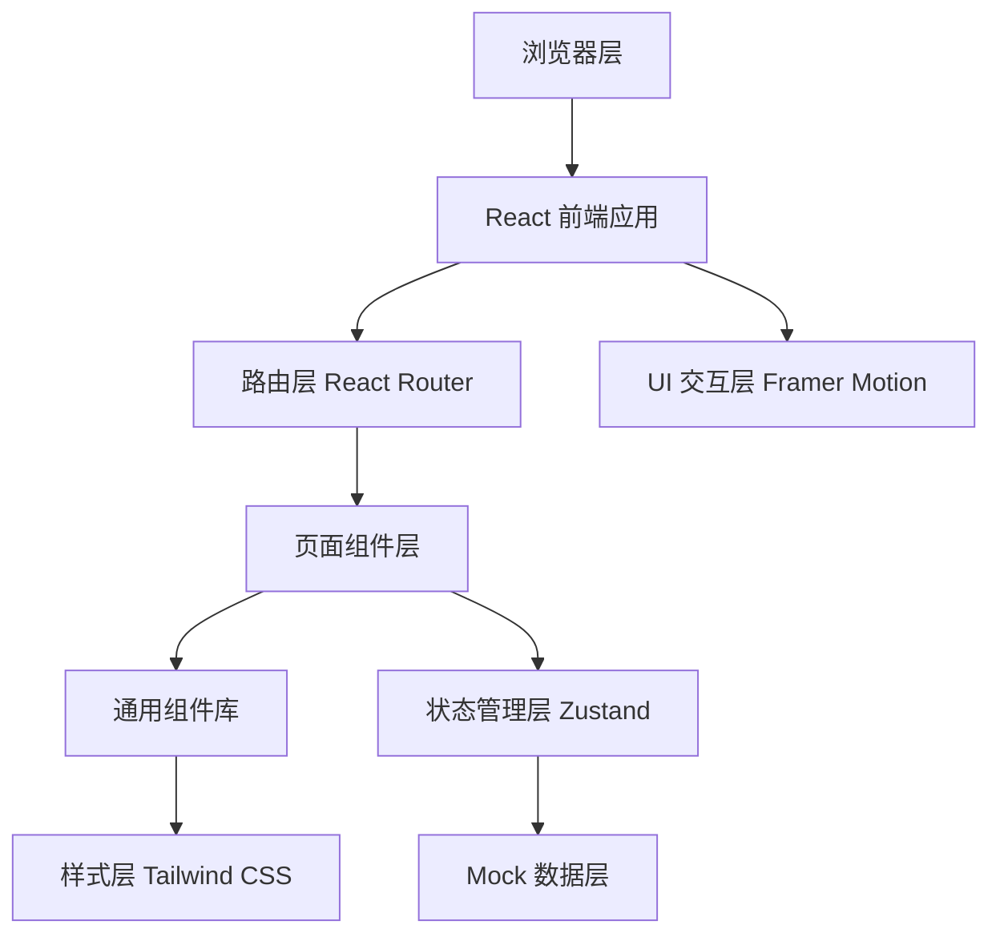

## 1. 架构设计



## 2. 技术说明

- 前端框架：React@18 + TypeScript
- 构建工具：Vite@5
- 路由管理：React Router DOM@6
- 状态管理：Zustand（轻量级状态管理）
- 样式方案：Tailwind CSS@3 + CSS Variables
- 动画库：Framer Motion
- 图标库：Lucide React
- 后端：无（纯前端 Mock 数据）
- 数据存储：LocalStorage（持久化收藏、下载历史等）

## 3. 路由定义

| 路由 | 页面 | 用途 |
|------|------|------|
| / | HomePage | 首页 - 精选软件、最新上架、限免提醒、热门讨论 |
| /app/:id | AppDetailPage | 软件详情页 - 版本记录、截图、评分、下载 |
| /category/:category? | CategoryPage | 分类页 - 办公/开发/设计/效率筛选 |
| /forum | ForumPage | 讨论区列表 - 帖子浏览、发帖入口 |
| /forum/:postId | ForumPostPage | 帖子详情 - 回复、引用、举报 |
| /user/profile | UserProfilePage | 个人中心 - 收藏、关注、下载历史、评价草稿 |
| /contributor | ContributorDashboard | 贡献者后台 - 提交软件、更新日志、认领维护 |
| /admin | AdminDashboard | 审核页 - 投稿审核、评论审核、链接审核、专题推荐 |
| /login | LoginPage | 登录页 |

## 4. 核心数据类型定义

```typescript
interface Software {
  id: string;
  name: string;
  icon: string;
  description: string;
  longDescription: string;
  category: 'office' | 'development' | 'design' | 'efficiency';
  subCategory: string;
  rating: number;
  ratingCount: number;
  downloadCount: number;
  version: string;
  versions: VersionRecord[];
  compatibility: {
    minMacOS: string;
    appleSilicon: boolean;
    intel: boolean;
  };
  screenshots: string[];
  downloadLinks: {
    official?: string;
    appStore?: string;
    local?: string;
  };
  price: {
    type: 'free' | 'paid' | 'limited_free';
    amount?: number;
    originalPrice?: number;
    limitedFreeEndsAt?: string;
  };
  alternatives: string[];
  isFeatured: boolean;
  isNew: boolean;
  createdAt: string;
  updatedAt: string;
  maintainerId?: string;
}

interface VersionRecord {
  version: string;
  date: string;
  changelog: string[];
}

interface Review {
  id: string;
  softwareId: string;
  userId: string;
  userName: string;
  userAvatar: string;
  rating: number;
  content: string;
  createdAt: string;
  isDraft?: boolean;
}

interface ForumPost {
  id: string;
  title: string;
  content: string;
  authorId: string;
  authorName: string;
  authorAvatar: string;
  board: string;
  tags: string[];
  isPinned: boolean;
  isHighlighted: boolean;
  viewCount: number;
  replyCount: number;
  createdAt: string;
  replies: ForumReply[];
}

interface ForumReply {
  id: string;
  postId: string;
  content: string;
  authorId: string;
  authorName: string;
  authorAvatar: string;
  quoteReplyId?: string;
  quoteContent?: string;
  isReported: boolean;
  createdAt: string;
}

interface User {
  id: string;
  name: string;
  email: string;
  avatar: string;
  role: 'user' | 'contributor' | 'admin';
  favorites: string[];
  followingAuthors: string[];
  downloadHistory: DownloadRecord[];
  draftReviews: Review[];
}

interface DownloadRecord {
  softwareId: string;
  softwareName: string;
  downloadedAt: string;
  source: string;
}

interface Submission {
  id: string;
  type: 'software' | 'changelog' | 'maintainer_claim';
  status: 'pending' | 'approved' | 'rejected';
  submittedBy: string;
  submittedAt: string;
  payload: Record<string, unknown>;
  reviewNote?: string;
}
```

## 5. 项目目录结构

```
src/
├── assets/              # 静态资源
├── components/          # 通用组件
│   ├── layout/         # 布局组件（Header, Footer, Sidebar）
│   ├── ui/             # UI 原子组件（Button, Card, Modal, Tabs 等）
│   └── features/       # 业务组件（SoftwareCard, ReviewList, ScreenshotViewer 等）
├── pages/              # 页面组件
├── store/              # Zustand 状态管理
├── data/               # Mock 数据
├── types/              # TypeScript 类型定义
├── hooks/              # 自定义 Hooks
├── utils/              # 工具函数
├── styles/             # 全局样式
├── App.tsx
├── main.tsx
└── router.tsx
```

## 6. 组件拆分策略

### 6.1 布局组件
- `Header.tsx`：顶部导航栏（Logo、搜索、用户菜单）
- `Footer.tsx`：页脚
- `Sidebar.tsx`：个人中心/后台侧边栏

### 6.2 UI 基础组件
- `Button.tsx`：按钮（主按钮、次按钮、幽灵按钮）
- `Card.tsx`：卡片容器
- `Modal.tsx`：模态框
- `Tabs.tsx`：标签页切换
- `Badge.tsx`：徽章/标签
- `Avatar.tsx`：用户头像
- `Rating.tsx`：星级评分组件
- `Input.tsx` / `Textarea.tsx`：输入框
- `Skeleton.tsx`：骨架屏加载

### 6.3 业务组件
- `SoftwareCard.tsx`：软件卡片
- `ScreenshotViewer.tsx`：截图预览灯箱
- `VersionTimeline.tsx`：版本记录时间线
- `ReviewList.tsx`：评价列表
- `ReviewForm.tsx`：评价表单
- `ForumPostCard.tsx`：讨论帖卡片
- `ForumReplyItem.tsx`：回复项组件
- `CategoryFilter.tsx`：分类筛选器
- `DataTable.tsx`：审核页数据表格

## 7. 状态管理设计

### 7.1 Store 划分
- `useAuthStore`：用户认证状态
- `useSoftwareStore`：软件数据、筛选、收藏状态
- `useForumStore`：讨论区帖子、回复状态
- `useUistore`：全局 UI 状态（模态框、Toast 等）
- `useAdminStore`：审核后台状态

## 8. 性能优化策略

- React.memo 包裹频繁渲染的列表项组件
- 图片懒加载（Intersection Observer）
- 路由级别代码分割（React.lazy + Suspense）
- 虚拟滚动处理长列表
- 防抖搜索输入
- LocalStorage 缓存常用数据
